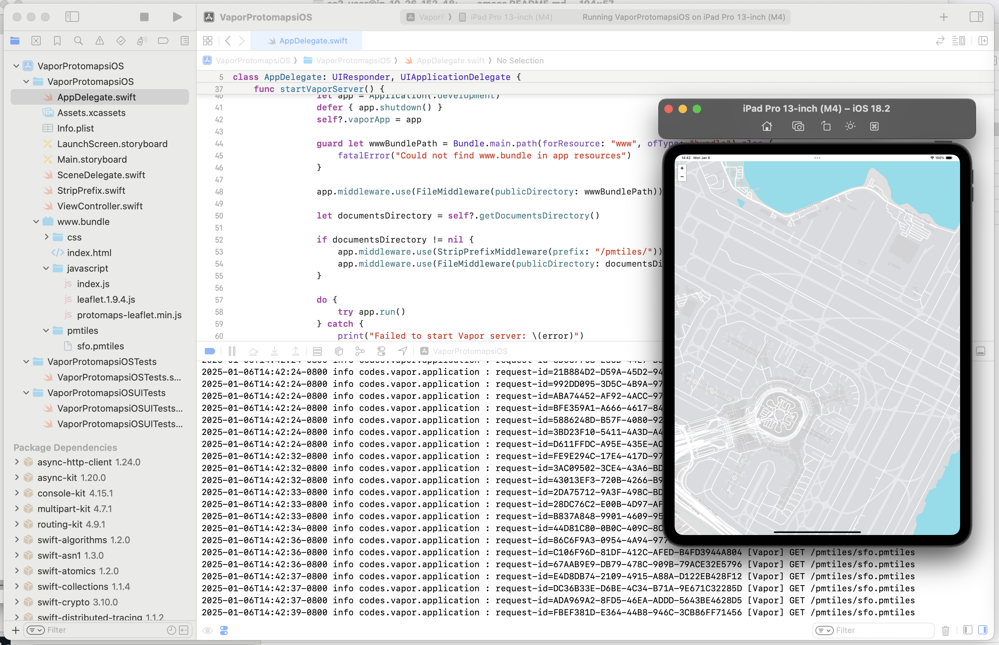

# VaporProtomapsiOS

Experimental iOS application demonstrating how to serve Protomaps tile databases from a Vapor-based server running in the background.

## Description



This is an experimental iOS application demonstrating how to serve Protomaps tile databases, stored in either an application's main "bundle" or its "Documents" folder, from a Vapor-based server running in the background.

This is work in progress and may change without notice.

## Notes

### AppTransportSecurity

You will need to ensure your application has the following `NSAppTransportSecurity` settings:

```
	<key>NSAppTransportSecurity</key>
	<dict>
		<key>NSAllowsLocalNetworking</key>
		<true/>
		<key>NSExceptionDomains</key>
		<dict>
			<key>localhost</key>
			<dict>
				<key>NSExceptionAllowsInsecureHTTPLoads</key>
				<true/>
				<key>NSIncludesSubdomains</key>
				<true/>
			</dict>
		</dict>
	</dict>
```

Note: The use of the `NSExceptionAllowsInsecureHTTPLoads` setting will prevent any application using this package from being accepted by the Apple AppStore. That's not a "feature" so much as an acceptable trade-off (for SFO Museum) since this package was developed for local/on-site applications.

There is work in progress to make all of this work with TLS certificates, and specifically self-signed certificates, but that work is not complete yet. Any help would be welcome.

## See also

* https://protomaps.com
* https://vapor.codes/