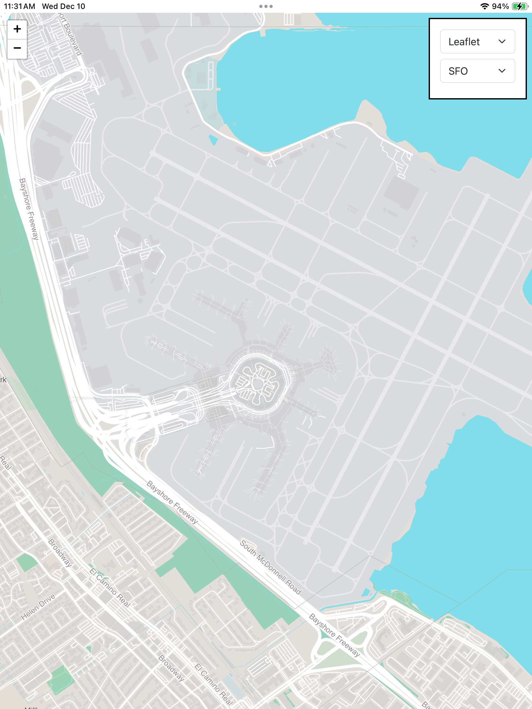
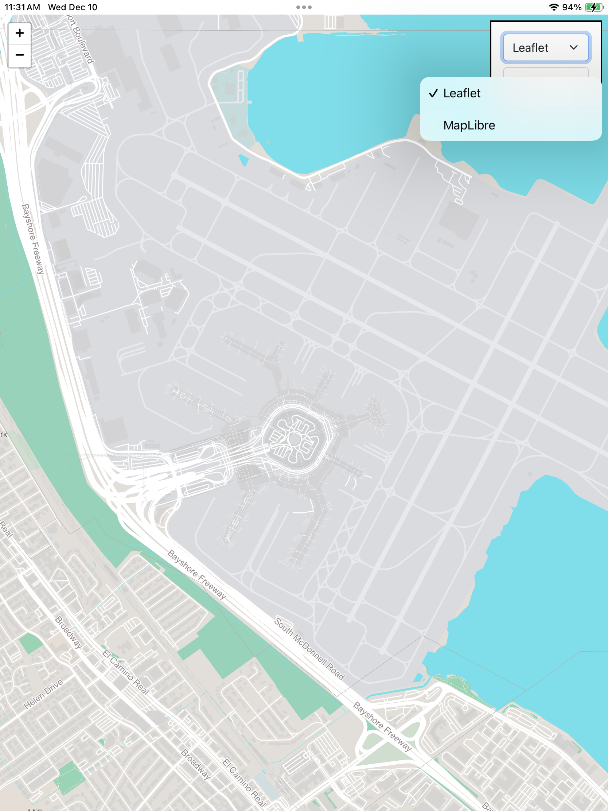
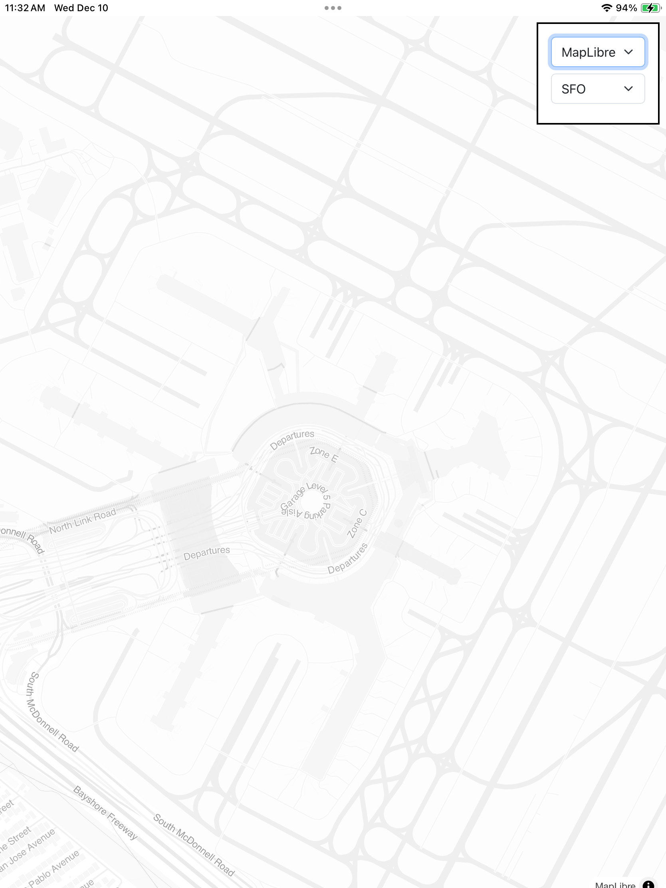
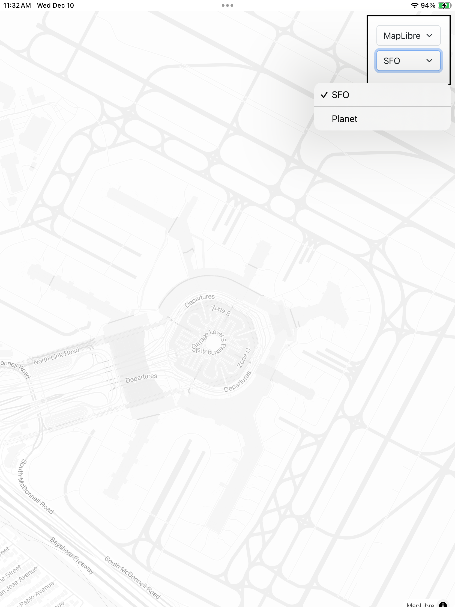
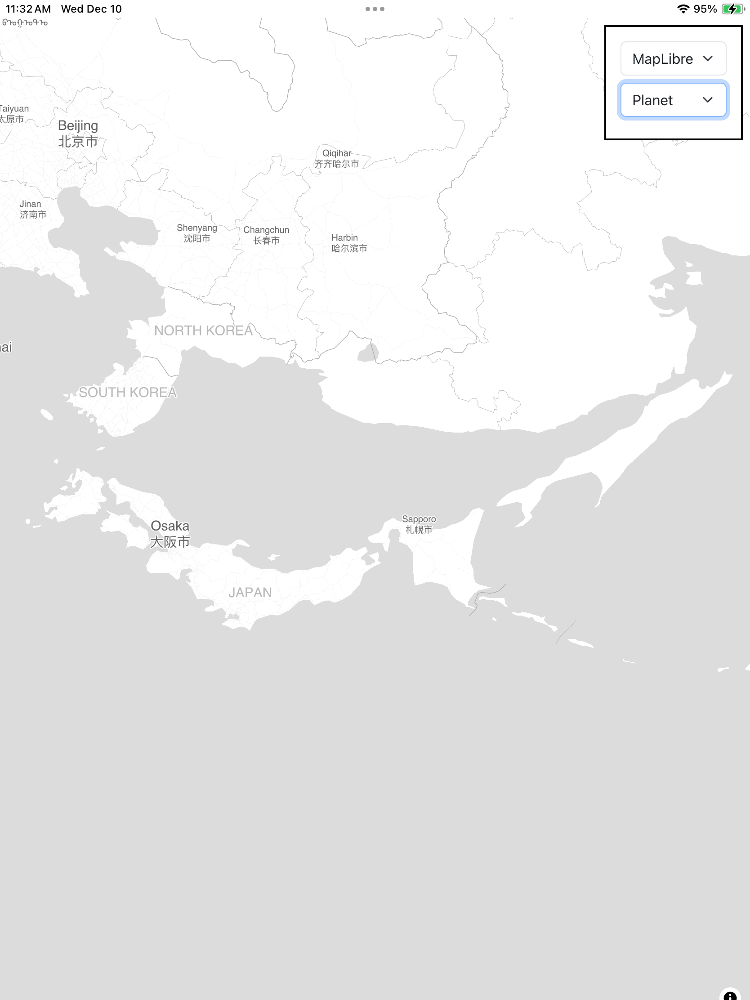
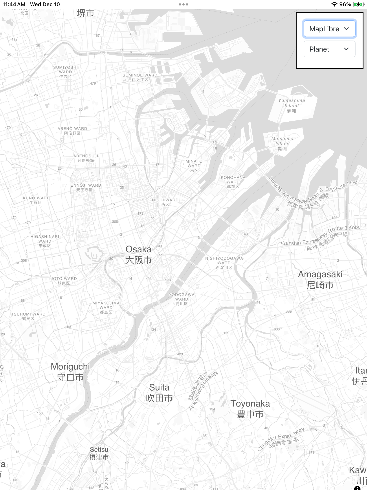
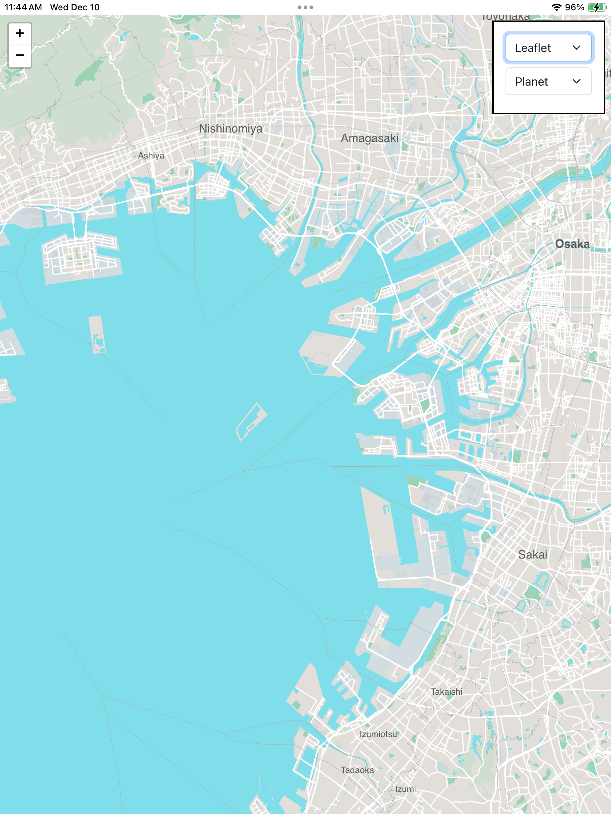

# VaporProtomapsiOS

Experimental iOS application demonstrating how to serve Protomaps tile databases from a Vapor-based server running in the background.

## Description


This is an experimental iOS application demonstrating how to serve Protomaps tile databases, stored in either an application's main "bundle" or its "Documents" folder, from a Vapor-based server running in the background.

## Example

The following example is copy-paste-ed from the code that runs this application. Consult the code in the [VaporProtomapsiOS](VaporProtomapsiOS) folder for a complete working example.

In a file called `Vapor.swift`:

```
import Vapor

extension Application {
    
    func configure() throws {

	// Set up CORS stuff 
        let corsConfiguration = CORSMiddleware.Configuration(
            allowedOrigin: .all,
            allowedMethods: [.GET, .OPTIONS],
            allowedHeaders: [.accept, .authorization, .contentType, .origin, .xRequestedWith, .userAgent, .accessControlAllowOrigin]
        )
        
        let cors = CORSMiddleware(configuration: corsConfiguration)
        self.middleware.use(cors, at: .beginning)

	// First set up a handler to serve requests for the example web application included
	// in the "www" bundle. This is necessary because I can not figure out how to make the
	// default "Public" directory stuff work...
        // https://docs.vapor.codes/advanced/middleware/
        
        guard let wwwBundlePath = Bundle.main.path(forResource: "www", ofType: "bundle") else {
            fatalError("Could not find www.bundle in app resources")
        }
        
        self.middleware.use(FileMiddleware(publicDirectory: wwwBundlePath))

	// Now set up a custom middleware handler (defined in Vapor_DocumentsMiddleware.swift)
	// to serve files from the application's Documents folder, specifically a global Protomaps
	// PMTiles database file named "planet.pmtiles". The order here is important. If this is
	// defined before the "publicDirectory" middleware then the web application (index.html, JS, etc.)
	// will try to be served from here.
        self.middleware.use(DocumentsMiddleware())
    }
}
```

And then in your application's `AppDelegate` file (or whereever):

```
        Task {
            
            do {
                let app = try await Application.make(.detect())
                try app.configure()
                try await app.execute()
            } catch {
                fatalError("Failed to start Vapor server: \(error)")
            }
        }
```

### Screenshots















## Notes

### AppTransportSecurity

You will need to ensure your application has the following `NSAppTransportSecurity` settings:

```
	<key>NSAppTransportSecurity</key>
	<dict>
		<key>NSAllowsLocalNetworking</key>
		<true/>
		<key>NSExceptionDomains</key>
		<dict>
			<key>localhost</key>
			<dict>
				<key>NSExceptionAllowsInsecureHTTPLoads</key>
				<true/>
				<key>NSIncludesSubdomains</key>
				<true/>
			</dict>
		</dict>
	</dict>
```

Note: The use of the `NSExceptionAllowsInsecureHTTPLoads` setting will prevent any application using this package from being accepted by the Apple AppStore. That's not a "feature" so much as an acceptable trade-off (for SFO Museum) since this package was developed for local/on-site applications.

There is work in progress to make all of this work with TLS certificates, and specifically self-signed certificates, but that work is not complete yet. Any help would be welcome.

## See also

* https://protomaps.com
* https://vapor.codes/